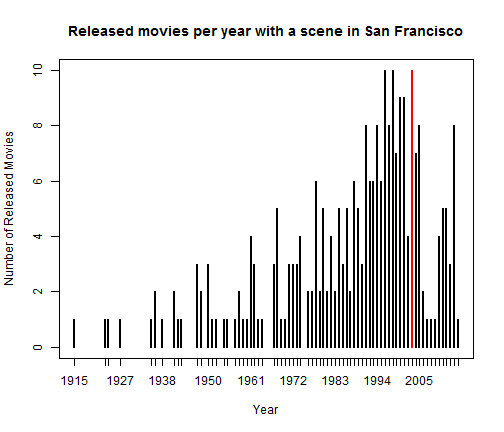

## Introduction


I created a Shiny app based on a dataset of Film Locations in San Francisco. 

The purpose of the app is to digest the information and show the trends of film in San Francisco over time, as well as show locations for each year in movies in a user readable format.

Dataset source: https://data.sfgov.org/Culture-and-Recreation/Film-Locations-in-San-Francisco/yitu-d5am

--- .class #id 

## Example Plot


```r
plot(table(datamovie$Release.Year), 
     col=ifelse(names(table(datamovie$Release.Year))==2003,"red","black"),
     ylab="Number of Released Movies", xlab = "Year",
     main="Released movies per year with a scene in San Francisco")
```

 


--- .class #id 

## Plot


In this given plot, it takes an example year (in this case 2003) and gives a way for the user to visualize the data as they are looking at it for that year. In 2003, a large amount of movies were filmed in San Francisco compared to other years. The featured red line provides easy visualization to see the activity for the selected year.

This table also gives an overall view of the trend of movies filmed in San Francisco, showing a lot of activity in the 90's.

--- .class #id 

## Text Output


The app features different types of text output so users can interpret results.

There is a confirmation line such as "Inputted year 2014 has 8 movies." which lets the user know how many movies were shot in that year.

Below that there is a data table shown that shows every location shot and which movie it was for, this allows the user to interact with the data and quickly find relevant information. This data table includes multiple scenes (for example, 8 movies in 2014 had 110 scenes) so while this is a lot more information this gives users the option to dig into the data and find more relevant information.

--- .class #id 

## Conclusion


This app has two purposes, to tell a story of the trends over time of film in San Francisco, and to provide an interface to explore that data. 

Through plots, users are able to visualize the data they're taking in and can also guide users into picking years to create a table for.

This app also makes a table making people interested in specific locations able to browse interesting data and learn things that they would want to learn about the given dataset.


